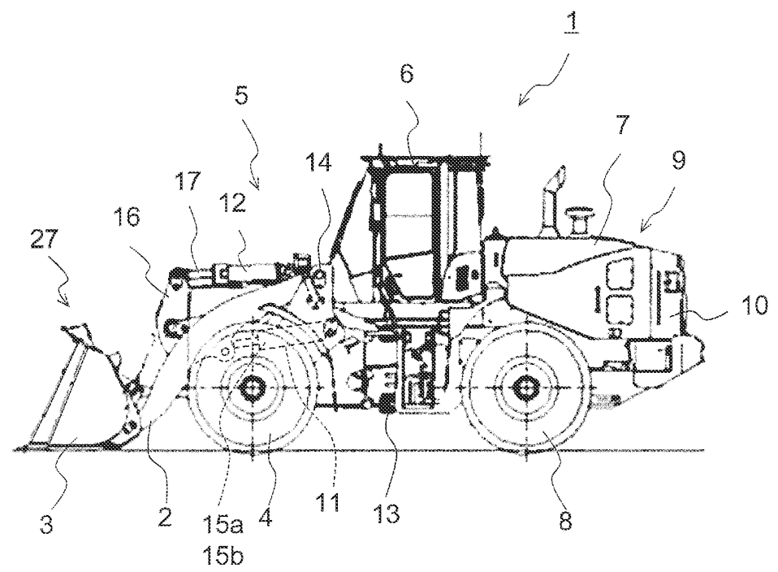
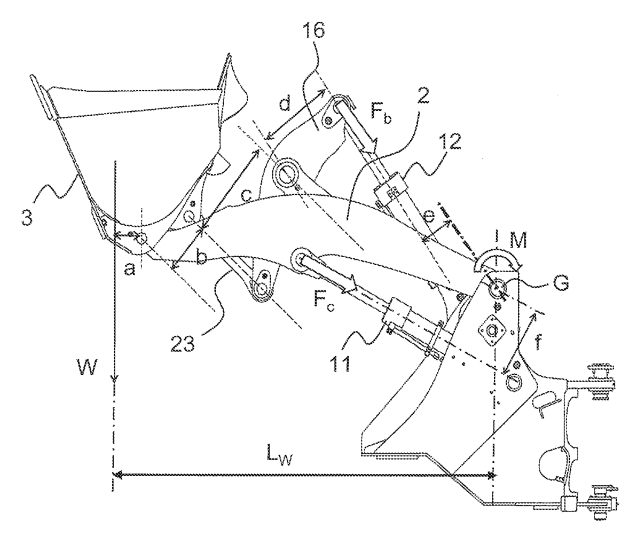

#  Static Load Estimation for Wheel Loader

## Table of Contents
- [Project Overview](#project-overview)
- [Wheel Loader Model](#wheel-loader-model)
- [Reference](#reference)

## Project Overview

### Environment
- OS: ubuntu 24.04
- MATLAB 2025b 

### File Structure

## Wheel Loader Model

<table align="center" style="border:none;">
  <tr>
    <td align="center" width="50%">
      
       
      <em>Overall model</em>
    </td>
    <td align="center" width="50%">
      
       
      <em>Detail model</em>
    </td>
  </tr>
</table>

### Variables
#### Load Calculation Variables
| Variable | Description | Unit |
| :--- | :--- | :--- |
| **n** | number of cylinders | - |
| **Ab** | bottom side pressure receiving area of cylinder | cm² |
| **Pb** | bottom pressure of cylinder | MPa |
| **Ar** | rod side pressure receiving area of cylinder | cm² |
| **Pr** | rod pressure of cylinder | MPa |
| **M** | moment around lift arm hinge pin | Nm |
| **Fc** | force applied to lift arm cylinder | N |
| **Fb** | force applied to bucket cylinder | N |
| **f** | horizontal length between hinge pin and vector of Fc | m |
| **e** | horizontal length between hinge pin and vector of Fb | m |
| **a** | horizontal length between load center and bucket pin hinge pin | m |
| **b** | distance between bucket pins | m |
| **c** | distance between push rod center length and bell crank center pin | m |
| **d** | distance between bell crank pins | m |
| **M1** | moment around lift arm hinge pin in loaded state | Nm |
| **M0** | moment around lift arm hinge pin in unloaded state | Nm |
| **W** | load | kg |
| **Lw** | horizontal length from gravity center position of load | - |

#### Dimension & Linkage Posture Variabless
| Variable | Description | Unit |
| :--- | :--- | :--- |
| **θg** | Lift arm angle ∠(horizontal, Lag) | deg |
| **Ldf** | Length between bell crank D pin and bucket cylinder root F pin | mm |
| **Ldg** | Length between bell crank D pin and lift arm hinge G pin | mm |
| **Lfg** | Length between bucket cylinder root F pin and lift arm hinge G pin | mm |
| **LfgX** | Horizontal length between bucket cylinder root F pin and lift arm hinge G pin | mm |
| **LfgY** | Vertical length between bucket cylinder root F pin and lift arm hinge G pin | mm |
| **∠DGA** | ∠(Ldg, Lag) | deg |
| **Laf** | Length between lift arm tip A pin and bucket cylinder root F pin | mm |
| **Lag** | Length between lift arm tip A pin and hinge G pin | mm |
| **∠FGO** | ∠(Lfg, Horizontal) | deg |
| **θf** | Bucket cylinder posture angle ∠(horizontal, Lef) | deg |
| **Lef** | Bucket cylinder stroke length | mm |
| **θe** | Bell crank posture angle ∠(Lde, Lef) | deg |
| **Lde** | Bell crank DE pin length | mm |
| **∠ADC** | ∠(Lad, Lcd) | deg |
| **Lad** | Length between lift arm tip A pin and center D pin | mm |
| **θd** | ∠(Lde, Lcd) | deg |
| **Lac** | Length between lift arm tip A pin and center C pin | mm |
| **Lcd** | Bell crank CD pin length | mm |
| **θc** | ∠(Lcd, Lbc) | deg |
| **Lbc** | Distance between push rod BC pins | mm |
| **Lab** | Distance between bucket AB pins | mm |
| **θb** | ∠(Lbc, Lab) | deg |
| **LloadG**| load center length | - |
| **HloadG**| load center angle | - |
| **Hbmcyl**| lift arm cylinder angle | - |

### Equations

#### Phase 1: Link Posture Angles & Base Distances
These formulas rely on the law of cosines and geometric constants to establish the fundamental angles of the linkage based on the lift arm angle $\theta_g$.

| Sequence | Doc Formula | Equation | Description / Purpose |
| :--- | :---: | :--- | :--- |
| **1** | (15) | $L_{df} = \sqrt{L_{dg}^2 + L_{fg}^2 - 2L_{dg}\{L_{fgX}\cos(\theta_g + \angle DGA) + L_{fgY}\sin(\theta_g + \angle DGA)\}}$ | Calculates the distance between bell crank D pin and bucket cylinder root F pin. |
| **2** | (16) | $L_{af} = \sqrt{L_{ag}^2 + L_{fg}^2 - 2L_{ag}L_{fg}\cos(\theta_g - \angle FGO)}$ | Calculates the distance between lift arm tip A pin and bucket cylinder root F pin. |
| **3** | (17) | $\theta_f = \tan^{-1}\{\frac{L_{dg}\sin(\theta_g + \angle DGA) - L_{fgY}}{L_{dg}\cos(\theta_g + \angle DGA) - L_{fgX}}\} + \cos^{-1}(\frac{L_{df}^2 + L_{ef}^2 - L_{de}^2}{2L_{df}L_{ef}})$ | Derives the bucket cylinder posture angle. |
| **4** | (18) | $\theta_e = \cos^{-1}(\frac{L_{de}^2 + L_{ef}^2 - L_{df}^2}{2L_{de}L_{ef}}) - 180$ | Derives the bell crank posture angle. |
| **5** | (19) | $\angle ADC = \cos^{-1}(\frac{L_{ad}^2 + L_{dg}^2 - L_{ag}^2}{2L_{ad}L_{dg}}) + \cos^{-1}(\frac{L_{df}^2 + L_{de}^2 - L_{ef}^2}{2L_{df}L_{de}}) - 180 - \theta_d$ | Derives the angle $\angle ADC$. |
| **6** | (20) | $L_{ac} = \sqrt{L_{ad}^2 + L_{cd}^2 - 2L_{ad}L_{cd}\cos\angle ADC}$ | Calculates the distance between lift arm tip A pin and center C pin. |
| **7** | (21) | $\theta_c = 180 + \cos^{-1}(\frac{L_{ac}^2 + L_{bc}^2 - L_{ab}^2}{2L_{ac}L_{bc}}) - \cos^{-1}(\frac{L_{cd}^2 + L_{ac}^2 - L_{ad}^2}{2L_{cd}L_{ac}})$ | Derives the link angle $\theta_c$. |
| **8** | (22) | $\theta_b = \cos^{-1}(\frac{L_{ab}^2 + L_{bc}^2 - L_{ac}^2}{2L_{ab}L_{bc}}) - 180$ | Derives the link angle $\theta_b$. |
| **9** | (14) | $\theta_i = \tan^{-1}\{\frac{L_{gi}\sin(\theta_g + H_{bmcyl}) + L_{ghY}}{L_{gi}\cos(\theta_g + H_{bmcyl}) + L_{ghX}}\} - (\theta_g + H_{bmcyl})$ | Derives the posture angle required to calculate the horizontal distance $f$. |

#### Phase 2: Inter-Link Distances & Load Coordinates
By substituting the variables from Phase 1 into trigonometric functions, the system determines the specific horizontal and vertical inter-link distances.

| Sequence | Doc Formula | Equation | Description / Purpose |
| :--- | :---: | :--- | :--- |
| **10** | (7) | $a = L_{loadG}\cos(\theta_g + \theta_c + \theta_d + \theta_e - \theta_b + 180 - H_{loadG})$ | Calculates the horizontal length between load center and bucket pin hinge pin. |
| **11** | (8) | $b = -L_{ab}\sin\theta_b$ | Calculates distance $b$. |
| **12** | (9) | $c = L_{cd}\sin\theta_c$ | Calculates distance $c$. |
| **13** | (10) | $d = -L_{de}\sin\theta_e$ | Calculates distance $d$. |
| **14** | (11) | $e = L_{fg}\sin\{(180 - \theta_f) + \angle FGO\}$ | Calculates the horizontal length between hinge pin and vector of $F_b$. |
| **15** | (12) | $f = L_{gi}\sin\theta_i$ | Calculates the horizontal length between hinge pin and vector of $F_c$. |
| **16** | (13) | $L_w = L_{ag}\cos\theta_g + L_{loadG}\cos(\theta_g + \theta_c + \theta_d + \theta_e - \theta_b + 180 - H_{loadG})$ | Calculates the horizontal length from gravity center position of load. |

#### Phase 3: Force, Moment, and Final Load Calculation
Using the geometric distances from Phase 2 and the actual cylinder pressures, the system calculates the internal forces, the moments around the hinge pin, and finally the payload $W$.

| Sequence | Doc Formula | Equation | Description / Purpose |
| :--- | :---: | :--- | :--- |
| **17** | (3) | $F_c = n(A_b P_b - A_r P_r)$ | Calculates the force applied to the lift arm cylinder using bottom and rod pressures. |
| **18** | (4) | $F_b = W \cdot (\frac{a}{b}) \cdot (\frac{c}{d})$ | Calculates the theoretical force applied to the bucket cylinder based on moment equilibrium. |
| **19** | (1) | $M = F_c f + F_b e$ | Derives the general moment around the lift arm hinge pin supported by the cylinders. |
| **20** | (5) | $M_1 = 2f(A_b P_b - A_r P_r) + W(\frac{a \cdot c \cdot e}{b \cdot d})$ | Expresses the moment $M_1$ in the loaded state by combining formulas 1, 3, and 4. |
| **21** | (2) | $W = \frac{M_1 - M_0}{L_w}$ | General relational expression for calculating load $W$ from loaded and unloaded moments. |
| **22** | (6) | $W = \frac{2f(A_b P_b - A_r P_r) - M_0}{L_w - (\frac{a \cdot c \cdot e}{b \cdot d})}$ | **The Final Load Calculation Formula:** Determined by substituting formula 5 into formula 2 to solve for $W$ directly from sensor values. |

## Reference
* **Patent:** US 2020/0131739 A1 (Hitachi Construction Machinery, Apr. 30, 2020). 