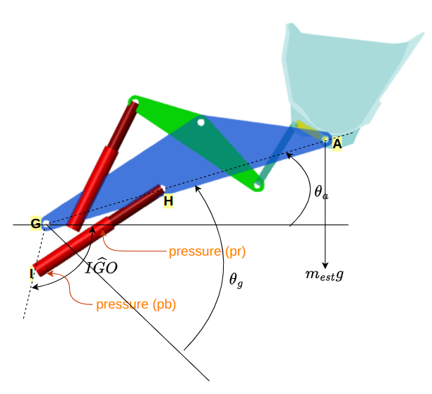
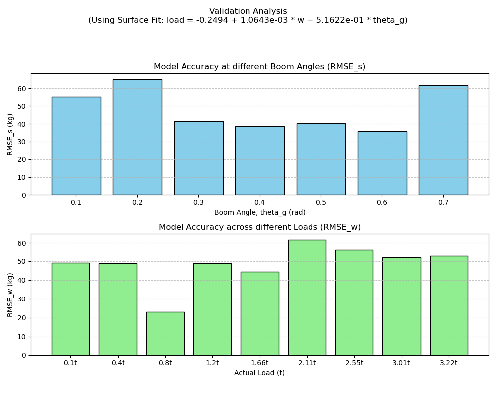
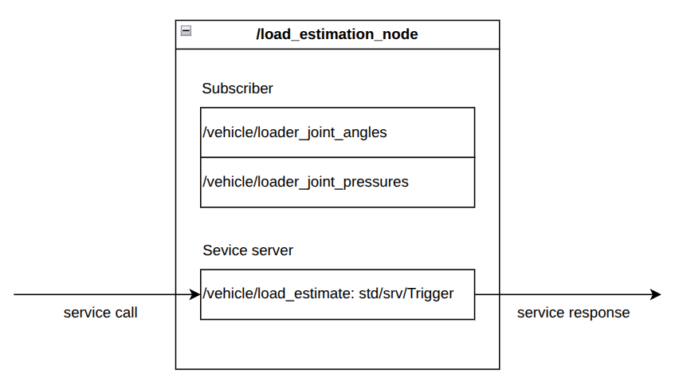

# Static Load Estimation for Wheel Loader

## Table of Contents
- [Project Overview](#project-overview)
- [Methodology](#methodology)
- [Results](#results)
- [Limitations](#limitations)
- [Ros2 Structure](#ros2-structure)
- [Use This Package](#use-this-package)

## Project Overview

This project provides a ROS2-based solution for estimating the payload in a wheel loader's bucket. The estimation is performed under **static conditions**, specifically after the **boom has been lowered**. By combining several modeling and data-driven techniques, the system achieves a high degree of accuracy, with a typical error of **±100kg** on a full capacity of 3tons.

## Methodology

The final load estimation is the result of a multi-stage process that filters raw sensor data, models physical behavior, and applies data-driven compensations to correct for model inaccuracies.

### Sensor Filtering

Raw data from the hydraulic pressure sensors and the boom angle encoder is inherently noisy. To ensure a stable and reliable input for the downstream calculations, **Exponential Moving Average (EMA)** filters are applied to both sensor streams. The filters for pressure and angle use different alpha values, tailored to the specific noise characteristics and dynamics of each signal.

The filter is defined by the equation:

`y_t = α * x_t + (1 - α) * y_{t-1}`

| Parameter | Value | Description |
| :--- | :--- | :--- |
| `y_t` | - | The filtered output at the current step. |
| `x_t` | - | The raw sensor input at the current step. |
| `y_{t-1}` | - | The filtered output from the previous step. |
| `α_pressure` | `0.001` | The smoothing factor for pressure sensors (low cutoff frequency). |
| `α_angle` | `0.1` | The smoothing factor for the angle encoder (higher cutoff frequency). |

### Pressure Estimator

To provide a rapid estimation without waiting for the hydraulic system to fully stabilize, a pressure estimator is used. This model treats the pressure response during a downward boom movement as a **first-order system**. By analyzing the initial transient pressure change `p(t)` after the boom stops, the model can quickly predict the final pressure value `p_final`. This significantly reduces the time required for a measurement.

The final pressure is estimated using the formula:

`p_final = (p(t) - p_initial * e^(-t/τ)) / (1 - e^(-t/τ))`

| Parameter | Value | Description |
| :--- | :--- | :--- |
| `p_final` | - | The predicted final pressure. |
| `p(t)` | - | The filtered pressure measured at time `t`. |
| `p_initial` | - | The initial pressure measured at the moment the boom stops (`t=0`). |
| `t` | `0` to `1.0` s | The time elapsed since the boom became static. |
| `τ` | `15.0` s | The time constant of the first-order system, derived from `0.25 * T_s`. |
| `T_s` | `60.0` s | The experimentally determined settling time of the hydraulic system. |

### Offset Empty Pressure

The weight of the loader's arm and bucket assembly exerts force on the hydraulic cylinders, resulting in a baseline pressure reading even when the bucket is empty. This offset pressure is not constant; it varies with the boom angle `θ_g`. To account for this, an offset model `p_offset(θ_g)` was created by fitting a curve to experimental data. This offset is subtracted from the pressure reading.

The offset models are:

`p_b_offset = c1 * θ_g + c2`

`p_r_offset = c3`

| Parameter | Value | Description |
| :--- | :--- | :--- |
| `c1` | `1699` | Coefficient for the boom angle in the `p_b_offset` model. |
| `c2` | `4023` | Intercept for the `p_b_offset` model (ADC value). |
| `c3` | `413.3` | Constant value for the `p_r_offset` model (ADC value). |
| `θ_g` | - | The boom angle from the encoder (rad). |


### Simple Beam Model

<p align="center">
  
</p>

To translate the force from the hydraulic cylinders into an estimated load, the arm-bucket assembly is modeled as a **simple beam system**. This provides a physics-based initial estimate of the bucket load (`w_simple`) based on the known geometry and the calculated cylinder force.

1.  **Cylinder Force (`F_c`)**:
    `F_c = 2 * (A_b * (p_b - p_b_offset) - A_r * (p_r - p_r_offset)) * C`

2.  **Geometry Factor (`a`)**:
    `a = sin(HIO) - cos(HIO) * tan(θ_a)`
    where `HIO`, `GIH`, and `L_ih` are intermediate geometric angles and lengths calculated from the loader's linkage constants and the current boom angle `θ_a`.

3.  **Simple Load (`w_simple`)**:
    `w_simple = (F_c * L_gh / L_ag) * a / g`

| Parameter | Value | Description |
| :--- | :--- | :--- |
| `A_b` | `0.02` m² | Cross-sectional area of the cylinder bottom. |
| `A_r` | `0.014` m² | Cross-sectional area of the cylinder rod side. |
| `C` | `1220.7` Pa/ADC | Conversion factor from sensor ADC value to Pascals (`40e6 / 32767`). |
| `L_gh` | `1.630` m | Length of the main boom link. |
| `L_ag` | `3.9294` m | Length of the lever arm from pivot to bucket. |
| `L_gi` | `0.654` m | Length of the cylinder link. |
| `IGO` | `1.786` rad | Fixed angle in the linkage geometry. |
| `θ_a` | `θ_g - 0.62` rad | Processed boom angle, corrected with an offset. |
| `g` | `9.807` m/s² | Acceleration due to gravity. |

### Surface Fit Compensate

The simple beam model contains inaccuracies due to its simplifying assumptions. To correct for these, a final compensation layer is applied. A comprehensive dataset was collected by measuring the simple model's output (`w_simple`) against known actual loads at various boom angles (`θ_g`). A linear model was then fitted to this data to create a compensation function.

The final load is calculated as:

`load_final [ton] = k1 + k2 * w_simple [kg] + k3 * θ_g [rad]`

| Parameter | Value | Description |
| :--- | :--- | :--- |
| `w_simple` | - | The initial load estimate from the Simple Beam Model (kg). |
| `θ_g` | - | The raw boom angle from the encoder (rad). |
| `k1` | `-0.2494` | Intercept term (ton). |
| `k2` | `1.0643e-03` | Coefficient for the simple model's output. |
| `k3` | `5.1622e-01` | Coefficient for the boom angle. |

## Results

The implemented methodology yields a load estimation with an accuracy of **~±100kg** for a full bucket capacity of 3tons, under the specified operating conditions (**theta_g = 0.3-0.6 rad**).

<p align="center">
  
</p>

## Limitations

While the current system is highly accurate, it operates under a set of constraints. This section details these limitations.

### 1. Static and Direction-Dependent Estimation

The current pressure estimator model is specifically designed for static conditions and is only validated for measurements taken after a **downward boom movement**. The first-order system response model does not apply to upward movements.

### 2. Model and Machine Specificity

The `Surface Fit Compensator` is highly tuned to the specific geometry and hydraulic system of the wheel loader used for development. The parameters (`k1`, `k2`, `k3`) will not be accurate for other loader models.

### 3. Load Type and Distribution

The system was trained and validated using water, which provides a uniform and evenly distributed load. Real-world materials like rocks or debris have non-uniform densities and can shift, changing the center of gravity.

### 4. Angle-Dependent Accuracy

As shown by validation data, the estimation accuracy varies at different boom angles (`theta_g`). This is likely due to the simplifications in the `Simple Beam Model`, which may not perfectly capture the linkage kinematics at the extremes of its range of motion.


## Ros2 Structure

<p align="center">
  
</p>

## Use This Package

Clone git repository
```bash
cd ~
git clone https://github.com/phattanaratjeedjeen-sudo/wheel_loader.git
```

Build package
```bash
cd ~/wheel_loader_ws
colcon build && source install/setup.bash
```

Launch 
```bash
ros2 run load_estimation load_estimate.py
```

Call service
```bash
# open new terminal
ros2 service call /load_estimat std_srvs/srv/Trigger 
```

Service response
- Success
    ```text
    response:
    std_srvs.srv.Trigger_Response(success=True, message='load(ton): 0.71')
    ```

- Failed
    ```text
    response:
    std_srvs.srv.Trigger_Response(success=False, message='Timeout: Static conditions not met within 3.0 seconds.')
    ```
