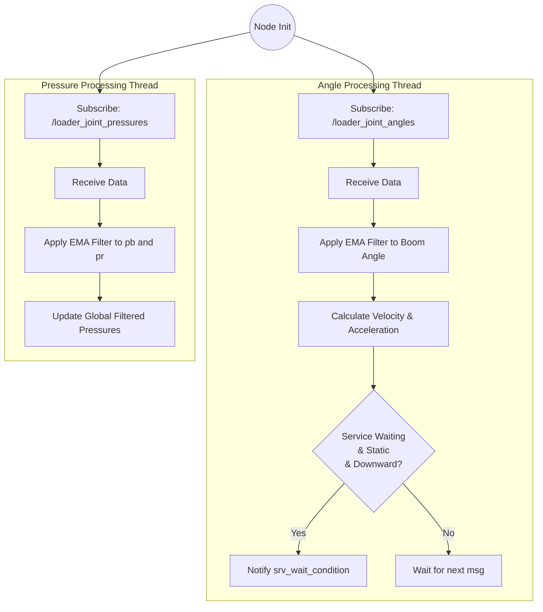
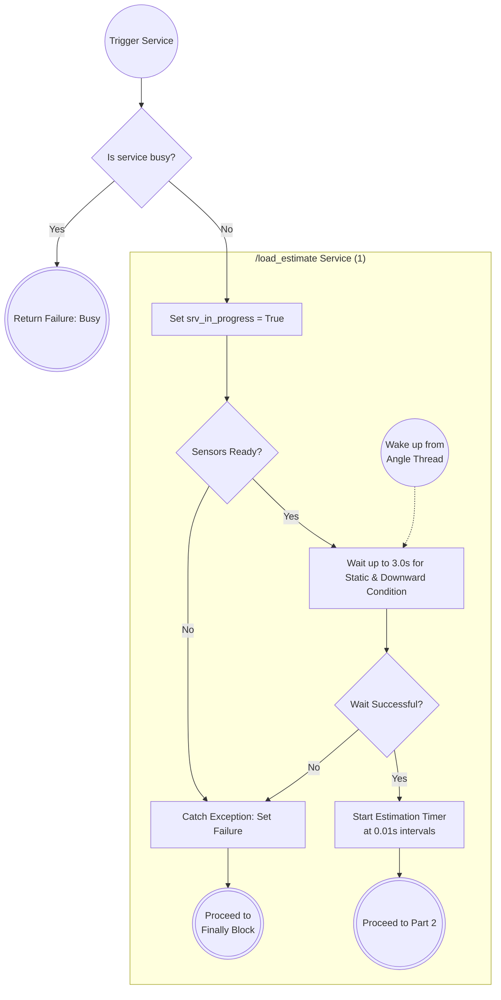
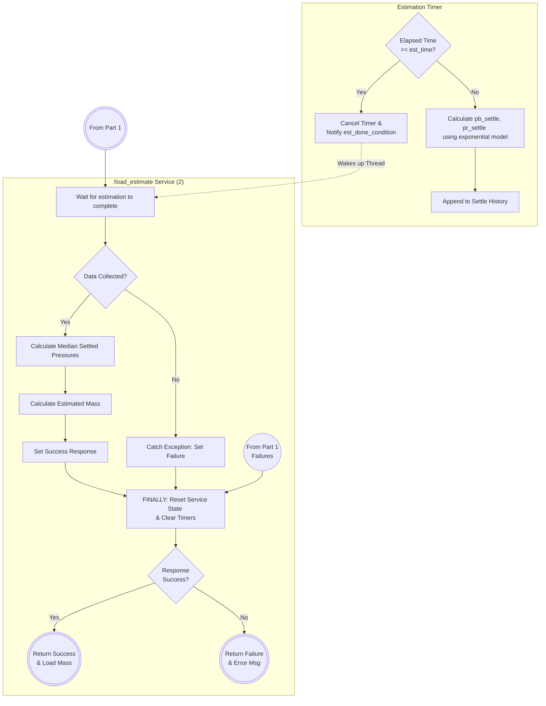

# Title Page
- Title: Development and Validation of a Hydraulic-Pressure Based Load Estimator for Static Wheel Loader
- Author: Phattanarat Jeedjeen

# Table of Contents
- [Introduction](#introduction)
    - [Background](#background)
    - [Scope and Operational Constraints](#scope-and-operational-constraints)
    - [Objectives](#objectives)
- [Modelling and Algorithm Development](#modelling-and-algorithm-development)
    - [Simple Beam Model](#simple-beam-model)
    - [Load Estimation Algorithm](#load-estimation-algorithm)
        - [Signal Processing](#signal-processing)
        - [Pressure Predicting](#pressure-predicting)
        - [Regression Model](#regression-model)
- [Implementation](#implementation)
    - [Software Flowchart](#software-flowchart)
    - [Hardware Component](#hardware-component)
- [Calibration Procedure](#calibration-procedure)
- [Result and Analysis](#result-and-analysis)

# Introduction
## Background
In modern industrial facilities, autonomous wheel loaders are critical for managing bulk biomass, such as scooping wood piles for furnace feeding and pile organization. However, a major gap exists in their ability to physically perceive and quantify payloads during the excavation phase. Operating "blindly" without human senses, these loaders struggle with the variable density of wood piles, often resulting in empty or under-loaded buckets that lead to wasted fuel, unnecessary machine wear, and operational bottlenecks. To resolve this, developing a Hydraulic-Pressure Based Load Estimator utilizing sensors on the lift cylinder will allow the system to calculate payload weight with in few seconds. This enables crucial payload verification, acting as a quality-control checkpoint that aborts transport and triggers a re-scoop if the load falls below a specific threshold, thereby eliminating inefficient "dry runs". Furthermore, knowing the precise weight allows the control system to implement adaptive kinematic control, dynamically adjusting velocity and acceleration profiles to account for changes in the machine's center of gravity and momentum. Tansforming the loader into an intelligent, physically-aware system.

## Scope and Operational Constraints
To ensure accurate payload verification and simplify the initial physical models, the development and validation of the load estimation system will be bound by the following scope and assumptions:
1. **Target Machinery**: The algorithms, physical dimensions, and sensor calibrations will be exclusively developed for the XCMG958 wheel loader.
2. **Static Conditions**: ForEstimation State: Rather than performing dynamic load weighing on the move, the mass estimation will be executed entirely under static conditions. The system will only record and process pressure sensor data after the boom has been lowered and the machine has come to a complete stop.
3. **Environmental and Posture Requirements**: To eliminate the effects of gravity offsets and external momentum, the loader must be stationary on flat, level ground during the measurement. Furthermore, the implement must be curled into a maximum tilt bucket posture to standardize the mechanical leverage.
4. **Center of Gravity Assumption**: For the physical model calculations, the payload is assumed to be distributed symmetrically, with the resultant center of gravity acting directly downward through the geometric center of the bucket.
5. **Boom Angular Range**: The system will only validate and process load estimations when the boom angle—tracked by the encoder at the boom-chassis pin —falls within a carefully specified operating range. Readings outside this angular window will be discarded to prevent kinematic calculation errors.

## Objectives
The primary goal of this project is to develop and validate a hydraulic-pressure based load estimator specifically for the XCMG958 autonomous wheel loader. To achieve this, the project targets the following specific objectives:
1. **Preventing "Run Dry" Operations**: To establish a quality-control checkpoint immediately following the scooping phase. By verifying the payload, the system can abort transport and command a re-scoop if the load falls below a predefined weight threshold, thereby eliminating unnecessary empty transport cycles.
2. **High-Speed Estimation**: To ensure the real-time mass calculation is highly efficient, with the entire estimation process completed within a strict maximum timeframe of 3 seconds.
3. **Target Accuracy and Sensor Fusion**: To accurately calculate payload weight by fusing data from a pressure sensor installed on the lift cylinder with positional data from a rotary encoder at the boom-chassis pin. This integrated system must achieve an estimation accuracy of within ±5% of the machine's full load capacity (3.2 tons).

# Modeling and Algorithm Development
The final load estimation is the result of a multi-stage process that filters raw sensor data, models physical behavior, and applies data-driven compensations to correct for model inaccuracies.

## Simple Beam Model

  

To translate the force from the hydraulic cylinders into an estimated load, the arm-bucket assembly is modeled as a **simple beam system**. This provides a physics-based initial estimate of the bucket load (`w_simple`) based on the known geometry and the calculated cylinder force.

1.  **Cylinder Force (`F_c`)**:
    `F_c = 2 * (A_b * (p_b - p_b_offset) - A_r * (p_r - p_r_offset)) * C`

2.  **Geometry Factor (`a`)**:
    `a = sin(HIO) - cos(HIO) * tan(θ_a)`
    where `HIO`, `GIH`, and `L_ih` are intermediate geometric angles and lengths calculated from the loader's linkage constants and the current boom angle `θ_a`.

3.  **Simple Load (`w_simple`)**:
    `w_simple = (F_c * L_gh / L_ag) * a / g`

| Parameter | Value | Description |
| :--- | :--- | :--- |
| `A_b` | `0.02` m² | Cross-sectional area of the cylinder bottom. |
| `A_r` | `0.014` m² | Cross-sectional area of the cylinder rod side. |
| `C` | `1220.7` Pa/ADC | Conversion factor from sensor ADC value to Pascals (`40e6 / 32767`). |
| `L_gh` | `1.630` m | Length of the main boom link. |
| `L_ag` | `3.9294` m | Length of the lever arm from pivot to bucket. |
| `L_gi` | `0.654` m | Length of the cylinder link. |
| `IGO` | `1.786` rad | Fixed angle in the linkage geometry. |
| `θ_a` | `θ_g - 0.62` rad | Processed boom angle, corrected with an offset. |
| `g` | `9.807` m/s² | Acceleration due to gravity. |

## Load Estimation Algorithm

### Signal Processing
Raw data from the hydraulic pressure sensors and the boom angle encoder is inherently noisy. To ensure a stable and reliable input for the downstream calculations, **Exponential Moving Average (EMA)** filters are applied to both sensor streams. The filters for pressure and angle use different alpha values, tailored to the specific noise characteristics and dynamics of each signal.

The filter is defined by the equation:

`y_t = α * x_t + (1 - α) * y_{t-1}`

| Parameter | Value | Description |
| :--- | :--- | :--- |
| `y_t` | - | The filtered output at the current step. |
| `x_t` | - | The raw sensor input at the current step. |
| `y_{t-1}` | - | The filtered output from the previous step. |
| `α_pressure` | `0.001` | The smoothing factor for pressure sensors (low cutoff frequency). |
| `α_angle` | `0.1` | The smoothing factor for the angle encoder (higher cutoff frequency). |

### Pressure Prediction
To provide a rapid estimation without waiting for the hydraulic system to fully stabilize, a pressure estimator is used. This model treats the pressure response during a downward boom movement as a **first-order system**. By analyzing the initial transient pressure change `p(t)` after the boom stops, the model can quickly predict the final pressure value `p_final`. This significantly reduces the time required for a measurement.

The final pressure is estimated using the formula:

`p_final = (p(t) - p_initial * e^(-t/τ)) / (1 - e^(-t/τ))`

| Parameter | Value | Description |
| :--- | :--- | :--- |
| `p_final` | - | The predicted final pressure. |
| `p(t)` | - | The filtered pressure measured at time `t`. |
| `p_initial` | - | The initial pressure measured at the moment the boom stops (`t=0`). |
| `t` | `0` to `1.0` s | The time elapsed since the boom became static. |
| `τ` | `15.0` s | The time constant of the first-order system, derived from `0.25 * T_s`. |
| `T_s` | `60.0` s | The experimentally determined settling time of the hydraulic system. |

### Regression Model
>Note:
>- To get constant value (c1, c2, c3, k1, k2, k3) see [Calibration Procedure](#calibration-procedure)
>- For other wheel loader model constant must be changed

#### Empty Bucket Pressure Offset
The weight of the loader's arm and bucket assembly exerts force on the hydraulic cylinders, resulting in a baseline pressure reading even when the bucket is empty. This offset pressure is not constant; it varies with the boom angle `θ_g`. To account for this, an offset model `p_offset(θ_g)` was created by fitting a curve to experimental data. This offset is subtracted from the pressure reading.

The offset models are:

`p_b_offset = c1 * θ_g + c2`

`p_r_offset = c3`

| Parameter | Value | Description |
| :--- | :--- | :--- |
| `c1` | `1699` | Coefficient for the boom angle in the `p_b_offset` model. |
| `c2` | `4023` | Intercept for the `p_b_offset` model (ADC value). |
| `c3` | `413.3` | Constant value for the `p_r_offset` model (ADC value). |
| `θ_g` | - | The boom angle from the encoder (rad). |

#### Surface Fit Compensation
The simple beam model contains inaccuracies due to its simplifying assumptions. To correct for these, a final compensation layer is applied. A comprehensive dataset was collected by measuring the simple model's output (`w_simple`) against known actual loads at various boom angles (`θ_g`). A linear model was then fitted to this data to create a compensation function.

The final load is calculated as:

`load_final [ton] = k1 + k2 * w_simple [kg] + k3 * θ_g [rad]`

| Parameter | Value | Description |
| :--- | :--- | :--- |
| `w_simple` | - | The initial load estimate from the Simple Beam Model (kg). |
| `θ_g` | - | The raw boom angle from the encoder (rad). |
| `k1` | `-0.2494` | Intercept term (ton). |
| `k2` | `1.0643e-03` | Coefficient for the simple model's output. |
| `k3` | `5.1622e-01` | Coefficient for the boom angle. |

# Implementation
## Software Architechture
### ROS2 Structure

  

### Flowchart

1. Continuous Topic Callbacks (Angles & Pressures)
This diagram covers what happens continuously in the background as the node receives sensor data.

2. Service Call: Initialization & Wait Conditions
This covers the first half of the /load_estimate service. It handles the initial trigger, checking if sensors are ready, and waiting for the loader to stop moving downward.

3. Service Call: Data Collection & Final Calculation
This covers the timer loop, the math calculations, the finally block resetting the node state, and the ultimate response sent back to the user.

## Hardware Component
- [PT5400](./material/PT5400_pressure_sensor.pdf)

# Calibration Procedure
> This procedure must be done if other wheel loader model is used

## Pressure Offset Model

**Table 1:** Empty Bucket Pressure Data for Offset Calibration

| theta_g (rad) | pbf (ADC) | prf (ADC) |
| :--- | :--- | :--- |
| 0.1 | | |
| 0.2 | | |
| 0.3 | | |
| 0.4 | | |
| 0.5 | | |
| 0.6 | | |
| 0.7 | | |

Fill the data in table 1 while there is no load in the bucket and use `linear` regression to find `prf(theta_g)`, threat `prf` as constant (`average value`)

where
- `prf (ADC)`: predicted pressure sensor value

## Surfface Fit Compensation Model

**Table 2:** Surfface Fit Compensate Calibration

| theta_g (rad) | 3% | 50% | 100% |
| :--- | :--- | :--- | :--- |
| 0.1 | | |
| 0.2 | | |
| 0.3 | | |
| 0.4 | | |
| 0.5 | | |
| 0.6 | | |
| 0.7 | | |

Fill the data (load value from [Simple Beam Model](#simple-beam-model)) in table 2 and use `sklearn` library to find `load_est(w, theta_g)` see example code [here](https://github.com/phattanaratjeedjeen-sudo/wheel_loader/blob/backup/src/load_estimation/scripts/others/surface_fit.py)

where
- `load_est`: final estimated load (ton)
- `x%`: percent load in the bucket

# Results
>Note: This result uses regression constant from 0.1, 1.66 and 3.22 tons calibration load (water in the bucket)

By vary the load(water) and boom angle, then calculate 
- `RMSE_s`: load root mean square error due to theta_g, indicate error effected by boom angle
- `RMSE_w`: load root mean square error due to load, indicate error effected by load in the bucket

The implemented methodology yields a load estimation with an accuracy of **~±100kg** for a full bucket capacity of 3tons, under the specified operating conditions (**theta_g = 0.3-0.6 rad**).

  

# Conclusion
This project successfully developed and validated a Hydraulic-Pressure Based Load Estimator for the XCMG958 autonomous wheel loader
. By fusing data from a lift cylinder pressure sensor with a boom-chassis pin rotary encoder
, filtering raw signals using Exponential Moving Average (EMA) models
, and processing the inputs through a physical Simple Beam Model coupled with a data-driven Surface Fit Compensation regression
, the system delivers precise payload feedback. Validated under static conditions on flat ground with the bucket at maximum tilt
 across a boom angle range of θ 
g
​
 =0.3 to 0.6 rad
, the estimator achieves an exceptional accuracy of ∼±100 kg for a full bucket
, easily satisfying the required ±5% (±160 kg) accuracy threshold of the 3.2-ton full capacity
. Furthermore, by utilizing a first-order pressure prediction model that estimates settled hydraulic pressures using only 1.0 second of static data
, the system bypasses the physical 60-second stabilization delay
 to complete the entire process well within the target 3-second operational window
. This high-speed performance effectively prevents inefficient "run dry" transport cycles by enabling instant payload verification and re-scooping commands
, while simultaneously providing the loader's central controller with the real-time physical feedback required for adaptive kinematic control to optimize velocity, acceleration, and driving safety
